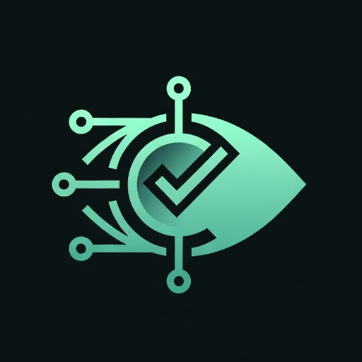

  

# FREETRUE-IA

**Herramienta libre y ciudadana para verificar contenidos audiovisuales
sospechosos de ser generados o manipulados por IA.**

Aportamos **señales verificables** que cualquiera puede reproducir por su
cuenta — no veredictos.

> 📄 Lee el [MANIFIESTO](MANIFIESTO.md) para entender por qué existe este
> proyecto y en qué principios se sostiene.

---

## Qué hace la app

Subes una imagen, un vídeo o pegas una URL, y obtienes un informe con:

- **Hash SHA-256** del archivo — identificador único, comparable.
- **Hash perceptual (pHash)** — identifica la imagen aunque haya sido
  recomprimida o redimensionada; permite coincidencias aproximadas con la
  base pública.
- **Metadatos EXIF** — cámara, fecha, edición, GPS si existen.
- **Credenciales C2PA / Content Credentials** — lectura con la librería
  oficial (quién firmó, con qué herramienta, si declara IA), con detección
  heurística de respaldo.
- **ELA (Error Level Analysis)** — mapa visual de recompresión donde las
  zonas editadas suelen «brillar» distinto.
- **Fotogramas de vídeo** — extracción en el navegador para analizarlos como
  imágenes: OCR, búsqueda inversa y pHash por fotograma.
- **Enlaces directos a búsqueda inversa** — Google Lens, TinEye, Yandex, Bing
  Visual — para que verifiques por tu cuenta si la imagen ha aparecido antes.
- **Wayback Machine** — consulta el historial archivado de la URL y archívala
  para preservar la evidencia.
- **OCR y contraste de la noticia** — extrae el titular de la imagen y genera
  búsquedas en medios y verificadores de España, Latinoamérica e
  internacionales.
- **Coincidencias con la base pública de casos** — exactas (SHA-256) y
  aproximadas (pHash).
- **Semáforo de veredicto** — señal automática + tu evaluación personal
  (verde/amarillo/rojo, con descripción obligatoria de la parte modificada).
- **Checklist manual de inspección** — señales visuales típicas de IA.
- **Informe exportable (JSON), imprimible y compartible por enlace** — el
  enlace re-verifica contra la base pública al abrirse.

Además: interfaz en **español, inglés y catalán**, tema claro/oscuro,
**instalable como app (PWA)** y un **[quiz educativo](https://jfsaints.github.io/FREETRUE-IA/quiz.html)**
para aprender el método.

Todo se ejecuta **en tu navegador**. Ningún archivo sale de tu dispositivo.

## Cómo usarla

- Versión pública: **https://jfsaints.github.io/FREETRUE-IA/** (activa tras
  el primer despliegue).
- Local: clona el repo y abre `index.html` en tu navegador. No requiere build.

## Cómo aportar un caso o verificar uno existente

- **Desde la app**: usa el formulario «¿No está claro? Aporta contexto» al
  final del informe. Prepara un issue de GitHub pre-rellenado; solo tienes
  que revisarlo y enviarlo.
- **Directamente en el repo**: abre un PR con un JSON en `casos/` siguiendo
  [CONTRIBUTING.md](CONTRIBUTING.md) y [casos/README.md](casos/README.md).

El modelo de verificación por pares (umbrales, conflictos de interés,
antisecuestro) está documentado en [docs/comunidad.md](docs/comunidad.md).

## Cómo contribuir al código

Pull requests bienvenidos. El proyecto es intencionadamente sencillo —
HTML + JS vanilla, sin build step — para que sea auditable y fork-eable.

## Aviso importante

FREETRUE-IA **no es un tribunal**. Aporta evidencias, no veredictos. Los
detectores de IA fallan; los metadatos pueden borrarse; una imagen sin
credenciales C2PA no es necesariamente falsa. La herramienta ayuda a mirar
mejor, pero el juicio final siempre es humano.

## Licencia

- Código y documentación: [MIT](LICENSE)
- Base de casos (`casos/`): CC BY 4.0

## Contacto

Vía [Issues](https://github.com/JFSAINTS/FREETRUE-IA/issues) del repositorio.
